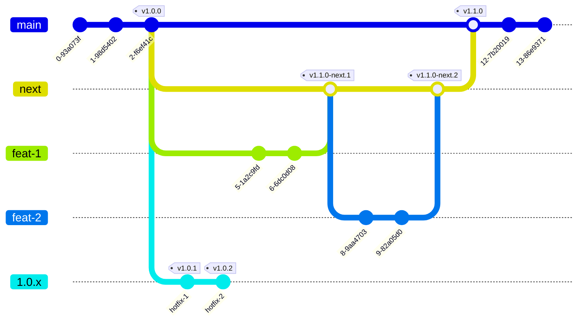

# Workflow Git - GitHub Workflow

Choosing the right Git workflow is crucial to enabling developers to work efficiently and securely, avoiding unnecessary time spent on cumbersome operations. The criteria we used for our decision are as follows:

- **High cohesion with automatic versioning tools**, to reduce complexity in version management.
- **Streamlined workflow**, allowing developers to focus on development rather than administrative tasks.
- **Flexible release management**, for both planned and unplanned releases.
- **Effective maintenance of legacy versions**, still in use by clients or other teams.

Our choice is **[GitHub Flow](https://docs.github.com/en/get-started/using-github/github-flow)**, following the **[Semantic Release Workflow configuration](https://semantic-release.gitbook.io/semantic-release/usage/workflow-configuration)**, similar to the workflow used by the [Angular Project](https://github.com/angular/angular):

**Branches**
- **`main`**: contains the latest version released to production.
- **`next`** (or `next-major`): represents the "in-development" version, which will be released as the next stable version.
- **`x.x.x`**: contains previous versions requiring fixes or additional feature integrations.

When `next` is ready, it is merged into `main`, and the branch is deleted. For new developments, a new `next` branch is created from `main`.
When a release is performed on a branch (`main`, `next`, or maintenance `x.x.x`), Semantic Release analyzes the commits since the last release and determines the version number to increment.
After determining the version number, update the `package.json` file with the new version, generate a changelog with the relevant changes and create a Git tag with the new version.
Tags are automatically created based on the new version calculated by Semantic Release, following the semantic versioning convention (e.g. `v1.0.0`).

## Feature and Fix Workflow

Each feature or fix must be developed in a dedicated branch. Merging these branches into `main`, `next`, or `maintenance` branches is only allowed via a merge request. To ensure quality and consistency, the merge request will be accepted only if the following conditions are met:

1. **Merge Request Template Compliance**: The merge request adheres to the predefined template, ensuring all necessary information is included.
2. **Self-Review**: The developer has reviewed their own code to catch obvious issues or omissions before submitting.
3. **Peer Review**: Another developer has reviewed and approved the changes, offering a second layer of verification.
4. **Pipeline Success**: All associated pipelines have been executed successfully.

## Pipelines

| Job                | Trigger                                                     | Stage   |
|--------------------|-------------------------------------------------------------|---------|
| **Install**        | Always                                                      | Prepare |
| **Build**          | Only in merge requests                                      | Test    |
| **Lint**           | Only in merge requests                                      | Test    |
| **Test**           | Only in merge requests                                      | Test    |
| **E2E**            | Optional for `next`, required for `main` and `maintenance`  | Test    |
| **Release**        | Only in `main`, `next` (or `next-major`), and `maintenance` | Release |
| **Deploy Staging** | Only in `next`                                              | Deploy  |
| **Deploy Prod**    | Only in `main` and `maintenance`                            | Deploy  |

## FAQ

### Why `next` and not `develop`?
`next` represents the future version of the software, is entirely managed by Semantic Release, and is linear. By containing only the changes for the new version and being deleted after development is complete, `next` avoids the back-merge issues that affect a `develop` branch. With `develop`, every time `main` receives a new version or a fix, constant updates would be required.

### Can `develop` be used instead of `next`?
No, it is not advisable to use `develop` instead of `next`. The `next` branch is designed to clearly and linearly represent the upcoming version of the software, fully managed by Semantic Release and pipelines. Using develop would introduce complications, such as the need to continuously manage merges and changes coming from main, which can lead to conflicts and a more complex development cycle. next avoids these issues by keeping the focus solely on the changes needed for the new version and is deleted once development is complete, thereby simplifying the workflow.

If a decision is made to introduce the `develop` branch anyway, it will be the team's responsibility to manage the numerous issues arising from this approach, which may prove to be outdated and impractical.

### Can I make a hotfix directly in `main`?
No. When a fix is needed for a production version:
1. Create a `maintenance` branch for the version that needs maintenance.
2. Create a `fix` branch and apply the fix on this branch.
3. Merge your fix in `maintenance`.
4. If the bug affects subsequent versions, create corresponding `maintenance` branches for those versions and cherry-pick the fix.
5. If the bug is present in the latest version, cherry-pick it to `main`.
6. If the bug affects the development version, cherry-pick it to `next`.

### Do I always need to create a `maintenance` branch?
No. If the project does not have legacy versions to maintain, it is not necessary to create `maintenance` branches. Fixes and improvements can be handled directly in `main` or `next`.

### Why aren't tests also performed in the main branches?
The main branches (main, next, x.x.x) are always considered stable by convention and therefore do not require test pipelines. The only time a main branch might be at risk is during the merging of a new feature. Therefore, it is at this point that we need to pay special attention and take action.
